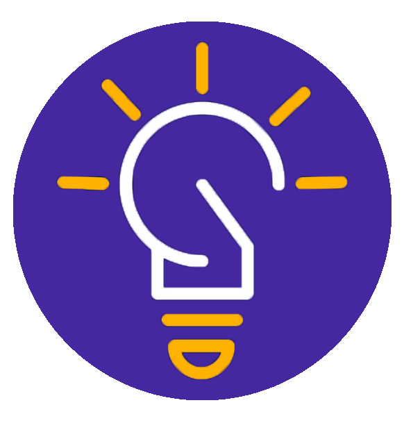
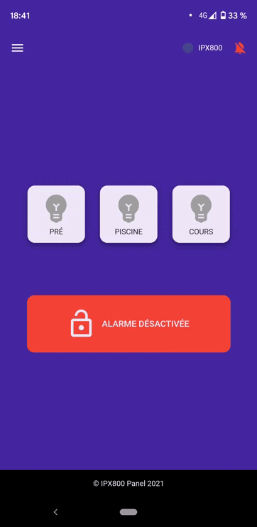
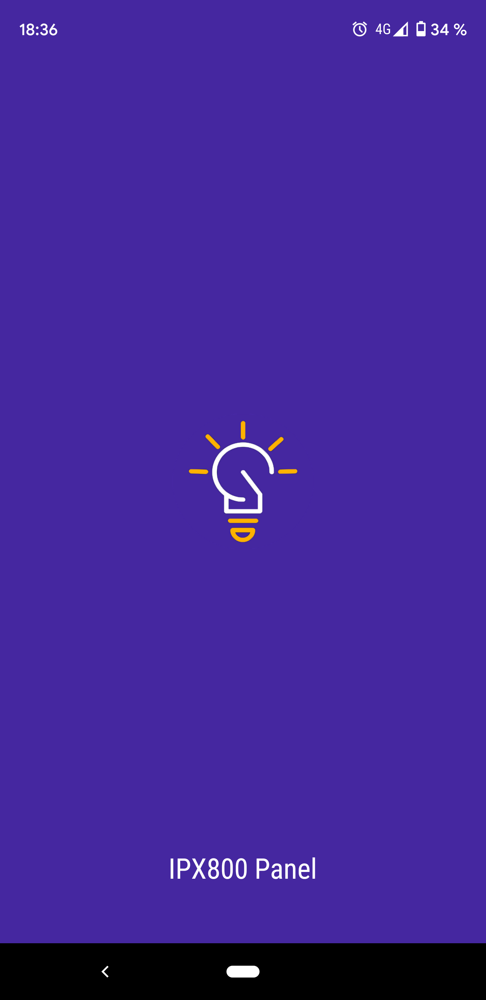
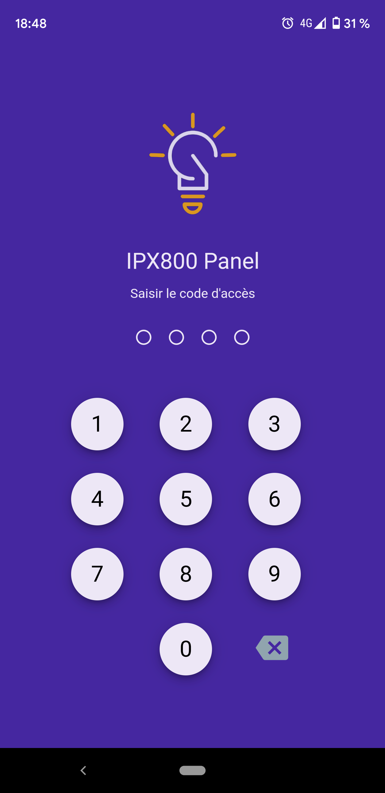
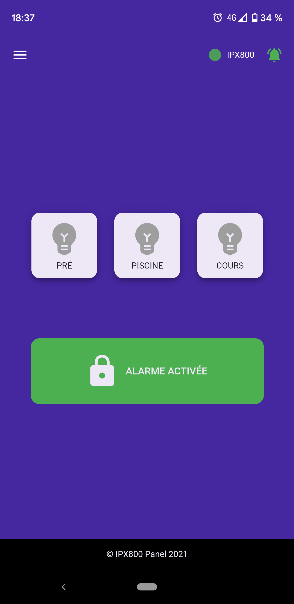
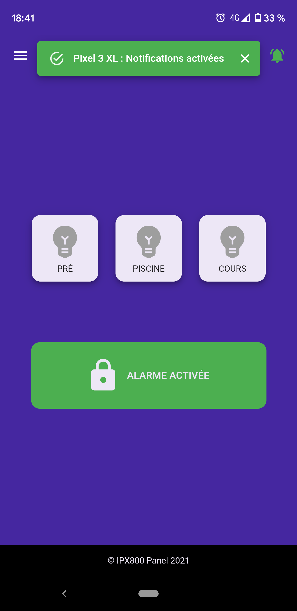
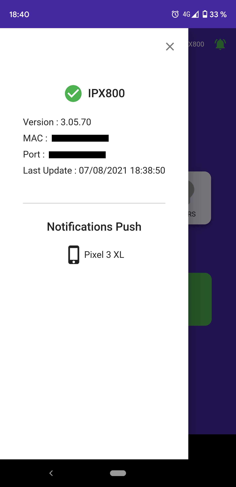
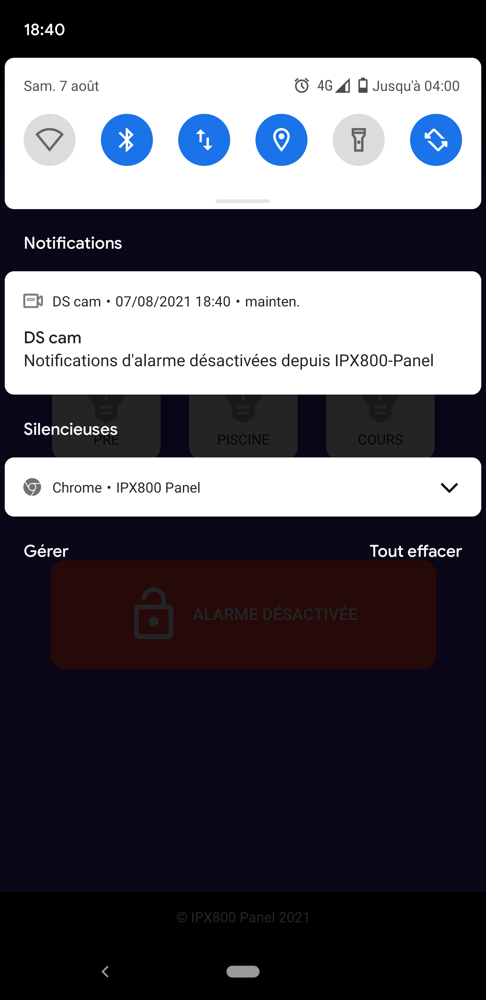

<p align="center">
    
</p>

# IPX800 Panel
### React/Redux PWA for GCE Electronics IPX800 controls with Synology Surveillance Station push notifications

    [](https://github.com/dwyl/esta/issues)




<p>
         
</p>

***

This Progressive Web Application allows to interact remotely with the integrated API of IPX800 v3 device from GCE Electronics.

It also allows to trigger push notifications of Synology Surveillance Station system for videoprotection applications.

***

### Launch dev :

Rename `.env.development.dist` to `.env.development` and set IPX800 and Synology Surveillance Station API url and authentication informations, for development environment.

```sh
# install dependencies
yarn
```
```sh
# launch dev server (listening on http://localhost:8080/)
yarn start
```


### Build :

Rename `.env.production.dist` to `.env.production.dist` and set IPX800 and Synology Surveillance Station API url and authentication informations, for production environment.

```sh
yarn build
```

Deploy it on a webserver and enjoy :-)
